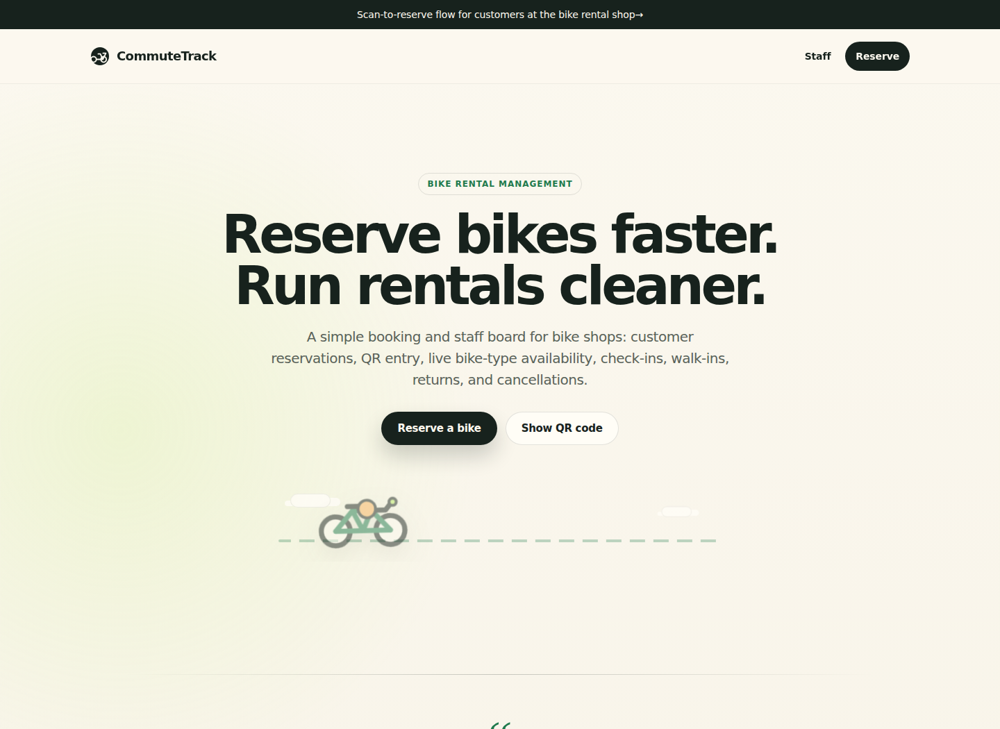
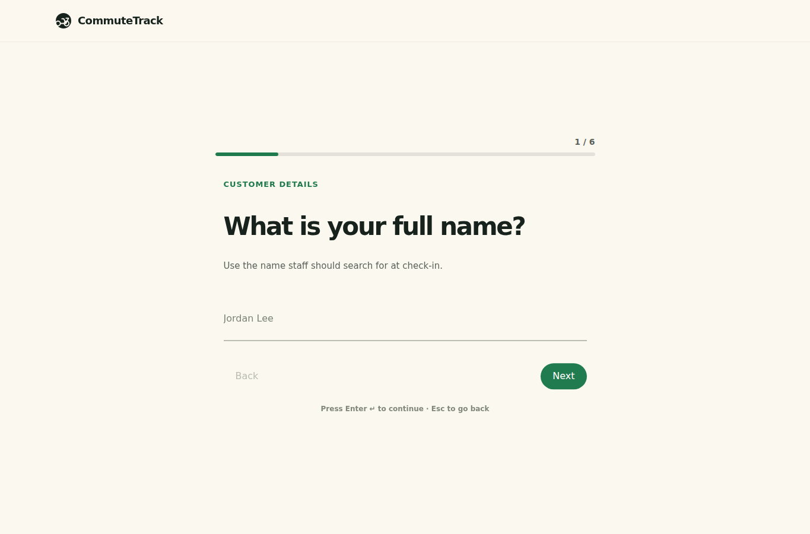
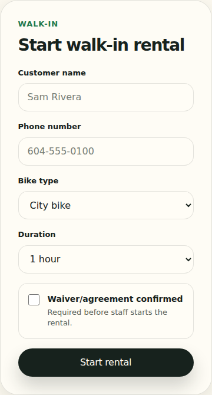

# Bike Rental and Availability Management System

A web-based bike rental management prototype for small bike rental shops. The system helps customers reserve bikes online or through an in-shop QR code, while staff manage daily reservations, walk-in rentals, bike availability, check-ins, returns, cancellations, and late rentals.

This project is focused on the required rental workflow from the SWE report: customer reservations, staff/clerk operations, bike-type availability, agreement confirmation, and rental status tracking. Payment processing, POS integration, notifications, analytics, and owner dashboards are outside the scope of this version.

## Screenshots

### Homepage



### Customer reservation workflow



### Staff walk-in rental panel



## Main Features

- Customer reservation workflow with one-question-at-a-time Typeform-style design
- QR code entry screen for customers at the shop
- Staff login for clerk-only rental operations
- Staff daily rental board with customer search
- Bike availability by type: City bike, Electric bike, and Cargo bike
- Group reservations with multiple bike selections
- Walk-in rental creation from the staff interface
- Reservation status updates: confirmed, active, returned, cancelled, late, and early return
- Return handling that frees bikes back into availability
- Local memory demo mode by default
- Optional MongoDB storage support when explicitly enabled

## Tech Stack

- React
- Vite
- Tailwind CSS
- Framer Motion
- React Hook Form
- QRCode
- Node.js HTTP API
- MongoDB driver, optional

## Getting Started

### 1. Install dependencies

```bash
npm install
```

### 2. Start the backend API

For the normal local demo, use memory storage. No Docker is required.

```bash
PORT=3001 STORAGE_DRIVER=memory npm run server
```

The backend runs at:

```text
http://localhost:3001
```

### 3. Start the frontend

In a second terminal:

```bash
npm run dev
```

The frontend runs at:

```text
http://localhost:5173
```

## Render Deployment

### One Render Web Service

Use this when Render should host both the API and the built React frontend from one URL.

```text
Build Command: npm install && npm run build
Start Command: npm start
```

Environment variables:

```text
STORAGE_DRIVER=memory
STAFF_EMAIL=staff@bikerental.local
STAFF_PASSWORD=staff123
```

After deployment, test:

```text
https://your-service-name.onrender.com/api/health
```

The backend also serves the built frontend routes, including `/`, `/qr`, `/qr-code`, `/login`, and `/staff`.

### Separate Frontend and Backend

If the frontend is deployed separately from the Render backend, set this build-time frontend variable:

```text
VITE_API_BASE_URL=https://your-backend-service.onrender.com
```

Without this variable, the frontend calls `/api/...` on its own domain.

## Demo Routes

| Page | URL | Purpose |
|---|---|---|
| Homepage | `/` | Project landing page |
| Reservation form | `/reserve` | Customer reservation workflow |
| QR reservation form | `/qr` | Same customer workflow opened from QR |
| Shop QR code | `/qr-code` | QR poster/page that sends customers to `/qr` |
| Staff login | `/login` | Staff authentication |
| Staff board | `/staff` | Daily rental board and walk-in rentals |

## Staff Demo Login

```text
Email: staff@bikerental.local
Password: staff123
```

These credentials are for the local demo. In a real deployment, use environment variables instead:

```bash
STAFF_EMAIL="staff@example.com"
STAFF_PASSWORD="replace-this-password"
```

## How the QR Flow Works

The QR feature has two parts:

1. Staff opens `/qr-code` and displays the QR code at the shop.
2. A customer scans it with a phone camera and lands on `/qr`, which opens the customer reservation workflow.

After a reservation is submitted, the confirmation screen shows a pickup QR/reference for the customer to present to staff.

## Optional MongoDB Mode

The project defaults to memory storage for easy local demos. To use MongoDB, provide a MongoDB connection string:

```bash
MONGODB_URI="mongodb://localhost:27017" npm run server
```

You can also set the database name:

```bash
MONGODB_DATABASE="bike_rental"
```

## Verification

Run the project verification script before committing or pushing:

```bash
./scripts/verify.sh
```

Expected checks:

```text
npm run lint
npm run build
```

Current known non-blocking warning:

```text
React Hook Form watch() compiler warning in ReservationPage.jsx
```

The build still passes.

## Project Scope

Included:

- Customer / renter reservation form
- QR code entry
- Staff / clerk interface
- Bike type availability
- Walk-in rentals
- Agreement confirmation
- Reservation lifecycle and returns

Not included in this version:

- Payment processing
- POS integration
- Owner dashboard
- Reporting analytics
- Notifications
- Mobile native app
